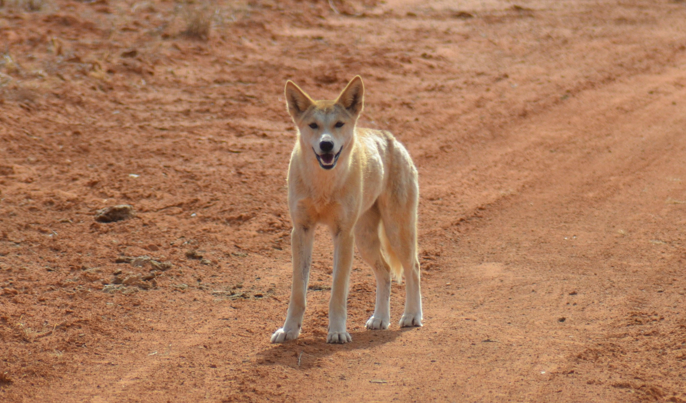

# Evolutionary Ecologist

### Education
- PhD, Biological Sciences | The University of New South Wales (May 2024)
- BSc (Hons) - First Class, Ecology | The University of New South Wales (Dec 2017)
- BEnvMgmt, Ecology | The University of New South Wales (Dec 2016)

### Work Experience
- **Adjunct Fellow** - UNSW Sydney, Evolution and Ecology Research Centre (May 2024 - *current*)
- **Graduate Research Assistant** - UWA, Centre for Environmental Economics and Policy (April 2024 - *current*)

### Projects
- **Evolution of Vertebrate Communication**

- **Chemical Communication of Dingo Scents**

Benjamin J J Walker, Mike Letnic, Martin P Bucknall, Lyn Watson, Neil R Jordan, Male dingo urinary scents code for age class and wild dingoes respond to this information, Chemical Senses, Volume 49, 2024, bjae004,
[Publication](https://doi.org/10.1093/chemse/bjae004)

### Contact
[Contact me](mailto:bjjwalker1@gmail.com)
