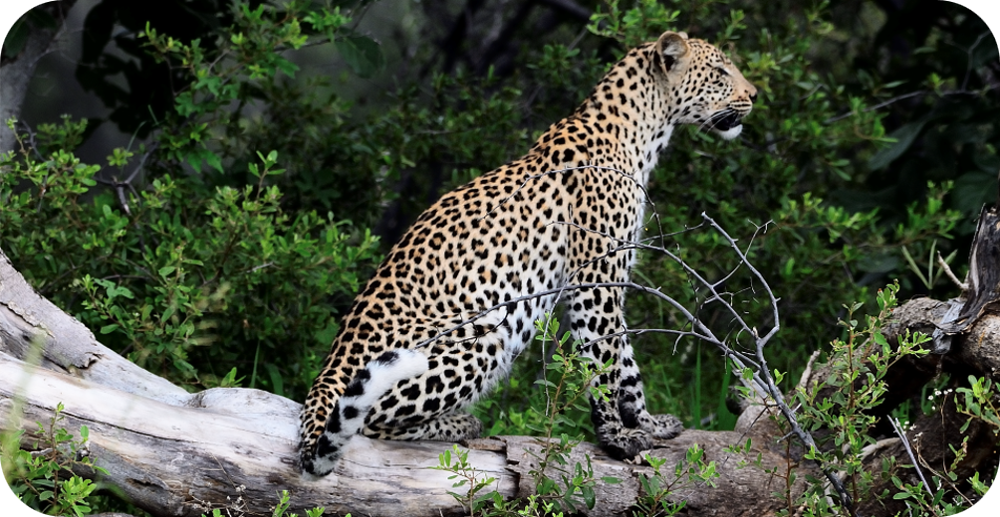

# Evolutionary Ecologist

### Technical Skills & Expertise: R-studio, Modelling, Macroevolution & Macroecology, Phylogenetics, Evolutionary Ecology, Bioacoustics

### [Contact](mailto:bjjwalker1@gmail.com)

### Education
- PhD, Biological Sciences | The University of New South Wales (2024)
- BSc (Hons) - First Class Honours, Ecology | The University of New South Wales (2017)
- BEnvMgmt, Ecology | The University of New South Wales (2016)

### Work Experience
**Adjunct Fellow** - UNSW Sydney, Evolution and Ecology Research Centre (2024 - *current*)
  - Supervising students in the Mammal Lab at UNSW 
  - Building and synthesising databases for scientific analysis
  - Writing and analysing data to prepare academic papers with multiple stakeholders

**Graduate Research Assistant** - UWA, Centre for Environmental Economics and Policy (2024 - *current*)
  - Bio-econometric modelling using a Bayesian framework to model the Norfolk Island ecosystem and management costs
  - Writing modules and synthesising literature to prepare academic papers  

### Projects
**Evolution of Vertebrate Communication**

**Chemical Communication of Dingo Scents**

### Teaching at UNSW Sydney
- BIOS1101 - Evolutionary and Functional Biology
- BIOS1301 - Ecology, Sustainability and Environmental Science
- BIOS6601 - An Introduction to the Sydney Environment
- MSCI0501 - The Marine Environment
- BEES2041 / BEES5041 - Data Analysis for Life and Earth Science
- SCI1111 / SCIF1131 - Introductory Skills for Science
- SCIF3000 - Science Industry Project Course

## Publications
1. Benjamin J J Walker, Mike Letnic, Martin P Bucknall, Lyn Watson, Neil R Jordan, Male dingo urinary scents code for age class and wild dingoes respond to this information, Chemical Senses, Volume 49, 2024, bjae004, [10.1093/chemse/bjae004](https://doi.org/10.1093/chemse/bjae004)

+++



<html>
  
  <section>
    

      
        
        
      
        

        

    

    

      
        
    

  </section>

